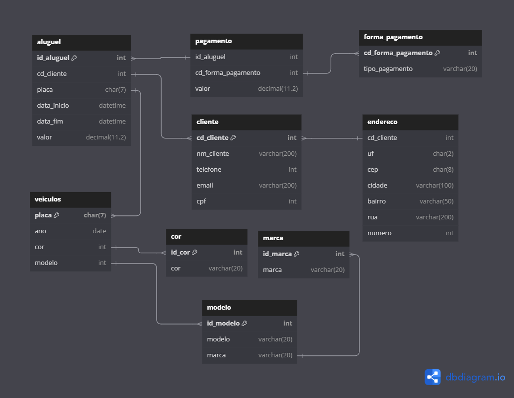

## Projeto Sistema de aluguel de carros - GRUPO A

### Integrantes
Arturo Burigo - [arturoburigo](https://github.com/arturoburigo) 
Edrik Steiner - [edrikfsteiner](https://github.com/edrikfsteiner) 
Gustavo Niero - [gustavoniero](https://github.com/gustavoniero) 
Luiz Antônio Bezerra - [BezzeraLuiz](https://github.com/BezerraLuiz) 
Vitor - [VitorKW](https://github.com/VitorKW) 
...

### Modelo Físico
Utilizamos a ferramenta de modelagem de dados [dbdiagram.io](https://dbdiagram.io/) para criação do modelo físico do banco de dados, para posterior exportação dos scripts DDL das tabelas e relacionamentos. 
Arquivo fonte: [Modelo Fisico](https://dbdiagram.io/d/trabalho-banco-6668ca856bc9d447b1724f8d). 

  
### Dicionário de Dados
As informações sobre as tabelas e índices foram documentados na planilha [Dicionário de Dados.xlsx](https://github.com/edrikfsteiner/aluguel-carros/blob/main/dicionario_dados/Dicion%C3%A1rio%20de%20Dados.xlsx).

### Scripts SQL
Para este projeto foi utilizado o banco de dados [Azure SQL](https://azure.microsoft.com/pt-br/products/azure-sql/database)  
Este é o procedimento para criação do banco de dados Azure SQL [Criando SQL Azure serverless no Azure gratuito - Sem cartão de crédito](https://github.com/jlsilva01/sql-azure-satc).

Abaixo, segue os scripts SQL separados por tipo:
+ [DDL](https://github.com/edrikfsteiner/aluguel-carros/tree/main/DDL)
+ [DML](https://github.com/edrikfsteiner/aluguel-carros/tree/main/DML)
+ [Functions](https://github.com/edrikfsteiner/aluguel-carros/blob/main/scripts_sql/function.sql)
+ [Indexes](https://github.com/edrikfsteiner/aluguel-carros/blob/main/scripts_sql/index.sql)
+ [Stored Procedures](https://github.com/edrikfsteiner/aluguel-carros/blob/main/scripts_sql/stored_procedure.sql)
+ [Triggers](https://github.com/edrikfsteiner/aluguel-carros/blob/main/scripts_sql/trigger.sql)

### Código Fonte do CRUD
- Linguagem de Programação Java 
- Framework SpringBoot
- JavaSPA e MYSQL driver

[Código Fonte](https://github.com/edrikfsteiner/aluguel-carros/tree/main/api)

### Relatório Final
O relatório final está disponível no arquivo [Documentação Banco de Dados.docx](https://github.com/edrikfsteiner/aluguel-carros/blob/main/Relat%C3%B3rio-Final/Documentac%CC%A7a%CC%83o%20Banco%20de%20Dados.docx).
